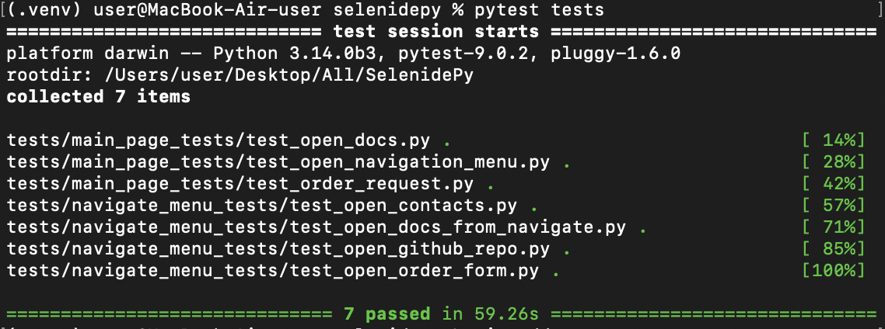

---------
UI Autotests for sverh.tech 
---------

The repository contains UI Autotests written in the Selenium + pytest framework for **sverh.tech**. 

These automated tests cover most of the functionality of the <https://sverh.tech> website.

--------
Installing and running tests
--------
1) Clone repository
2) Setup test environment:

python3 -m venv .venv

source .venv/bin/activate (macOS, Linux) or

.venv\Scripts\activate (Windows)

pip install pytest selenium (or requierments.txt)
3) These repo includes local version of chrome.webdriver, so you dont need to install it manually
4) After installing use **pytest tests** in terminal

---------
Based on the intellectual property of third parties, by open source. Using only as example. 

